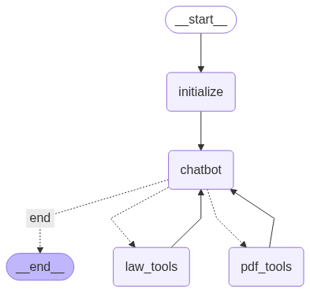

# YAKTALK

YakTalk is a legal assistant that analyzes PDF documents and answers questions citing Korean statutes. It uses LangGraph for orchestration, ChromaDB for vector storage, and Ollama models for local inference.

## 🌟 User Interfaces

### 🌐 Web Interface (Recommended)
Modern web-based chat interface powered by Chainlit:
```bash
./start_web.sh
# Access: http://localhost:8000
```

### 💻 Terminal Interface
Command-line interface:
```bash
python main.py
```

## Key Features

- PDF document ingestion and chunked retrieval
- Korean law lookup (National Law Information Center API)  
- Responses grounded with article citations
- Local embedding for PDFs (privacy, speed)
- Persistent ChromaDB stores for PDFs and laws
- Web-based file upload and chat interface
- Real-time document processing and analysis

## Architecture


```
User Query
   -> PDF Retrieval (search_pdf_content)
   -> Law Retrieval (search_law_by_query)
   -> Response (with legal citations)
```

### Core Components

1. **PDF Processing** (`call_functions/pdf_reader.py`): load, split, embed, store
2. **Law API** (`call_functions/law_api.py`): fetch, normalize, embed statutes  
3. **Chat Orchestrator** (`main.py`): tool routing, state, answer synthesis
4. **Web Interface** (`app.py`): Chainlit-based web UI with file upload

## Prerequisites

- Python 3.8+
- Ollama running with required models
- OPEN_LAW_GO_ID (National Law API credential)

## Installation

Clone and enter project:
```bash
git clone https://github.com/yourusername/yaktalk.git
cd yaktalk
```

Create and activate virtual environment:
```bash
python -m venv .venv
source .venv/bin/activate  # Windows: .venv\Scripts\activate
```

Install dependencies:
```bash
pip install -r requirements.txt
```

Environment variables (`.env`):
```env
# Required: LLM Service Configuration
LLM_SERVICE=ollama                    # or "openai"  
LLM_MODEL=qwen3:14b                   # model name for chosen service

# Required: Ollama Configuration (if using ollama)
OLLAMA_SERVER_URL=http://localhost:11434
OLLAMA_SERVER_PORT=11434              # optional, defaults to 11434

# Required: OpenAI Configuration (if using openai)
OPEN_API_KEY=your_openai_key_here     # required if LLM_SERVICE=openai

# Required: Korean Law API
OPEN_LAW_GO_ID=your_id_here           # National Law Information Center API key

# Optional: Data Directory
DATA_DIR=./data                       # defaults to "./data"
```

Pull Ollama models:
```bash
# recommended models
ollama pull qwen3:14b
ollama pull nomic-embed-text
```

## Usage

### 🌐 Web Interface (Recommended)

Start the web application:
```bash
./start_web.sh
```

Then:
1. Open http://localhost:8000 in your browser
2. Upload a PDF file using the chat interface
3. Ask questions about the document
4. Receive responses with legal citations

See [WEB_INTERFACE_GUIDE.md](WEB_INTERFACE_GUIDE.md) for detailed usage.

### 💻 Terminal Interface

Start the terminal version:
```bash
python main.py
```

Place PDFs in `data/` directory, then select one at startup. Ask factual or legal questions referencing the loaded PDF.

Exit commands: `quit`, `exit`, `q`, `/exit`.

## Configuration

PDF config (`PDFConfig` in `pdf_reader.py`):
```python
chunk_size = 1024
chunk_overlap = 100
max_content_length = 500
collection_name = "pdf_documents"
search_k = 5
```

Law config (`LawConfig` in `law_api.py`):
```python
chunk_size = 1024
chunk_overlap = 100
max_articles = 50
search_threshold = 2
timeout = 10
```

## How It Works

1. **PDF Processing**: Document upload, page extraction, and chunking
2. **Vector Storage**: Local embedding and ChromaDB persistence
3. **Query Processing**: Retrieve PDF context and relevant statutes
4. **Response Generation**: AI synthesis with legal article citations

## Web Interface Features

- **📄 Drag & Drop Upload**: Easy PDF file upload
- **⚡ Real-time Processing**: Instant document analysis
- **💬 Interactive Chat**: Natural language conversation
- **🎯 Legal Citations**: Precise statute references
- **📱 Responsive Design**: Works on mobile and desktop

## Troubleshooting

### Common Issues

1. **Web Interface Won't Start**: Check Ollama server status
2. **PDF Upload Fails**: Verify file size (<50MB) and format
3. **No Responses**: Ensure all environment variables are set

### Performance Tips

- Keep PDFs under 10MB for optimal performance
- Use GPU acceleration if available
- Monitor memory usage with large documents
