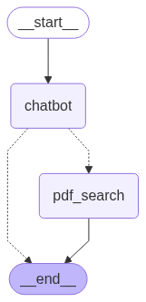

# yaktalk

1. user query + pdf file
2. parse & embed pdf file -> in mem. DB
3. summarize pdf -> query / compare to knowledge-base
4. highlight appropriate parts based on prev. output

Launch from `main.py`

### `.env` setup 
create `.env` @ root dir
```bash
# "openai" | "ollama"
# any service that supports the openai's v1
LLM_SERVICE="openai"
LLM_MODEL="gpt-oss:20b"

# when using Ollama
OLLAMA_SERVER_URL="address-here"
OLLAMA_SERVER_PORT="11434"

# when using OpenAI API
OPEN_API_KEY="sk-proj-..."
```



## TODO

1. [replace `similarity_search` to `retriever`](https://python.langchain.com/docs/how_to/vectorstore_retriever/) (동합된 vector store retrieval 환경)