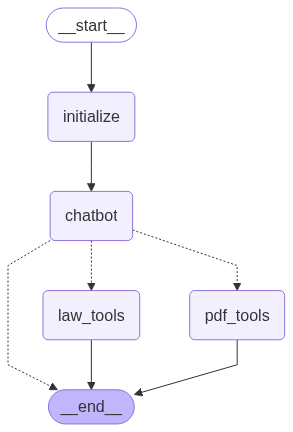

# YAKTALK

YakTalk is sophisticated AI-powered legal assistant that analyzes PDF documents and provides legally-grounded responses based on Korean statutes. The system uses LangGraph, ChromaDB, and Ollama to create an intelligent workflow that examines documents and cites relevant legal provisions.

## 🎯 Key Features

- **PDF Document Analysis**: Upload and analyze any PDF document (contracts, agreements, legal documents)
- **Korean Law Integration**: Automatically retrieves relevant Korean statutes from the National Law Information Center API
- **Legal Citation**: All responses are grounded in specific legal provisions with proper article citations
- **Intelligent Workflow**: PDF analysis → Legal statute retrieval → Law-based response generation
- **Persistent Storage**: Uses ChromaDB for efficient vector storage and retrieval
- **Local Embeddings**: PDF processing uses local sentence-transformers for privacy and speed

## 🏗️ Architecture


```
User Query
    ↓
PDF Analysis (search_pdf_content)
    ↓
Legal Statute Search (search_law_by_query)
    ↓
Law-Based Response (with article citations)
```

### Core Components

1. **PDF Processing Module** (`call_functions/pdf_reader_chroma.py`)
   - Loads and chunks PDF documents
   - Creates vector embeddings using local models
   - Stores in ChromaDB for efficient retrieval

2. **Law API Module** (`call_functions/law_api.py`)
   - Interfaces with Korean National Law Information Center
   - Retrieves and processes legal statutes
   - Maintains legal document vector store

3. **Main Chatbot** (`main_law_chatbot.py`)
   - Orchestrates the workflow using LangGraph
   - Manages tool routing and state
   - Ensures responses are legally grounded

## 📋 Prerequisites

- Python 3.8+
- Ollama with `qwen3:14b` model installed 
- Korean National Law Information Center API key

## 🚀 Installation

1. **Clone the repository**
```bash
git clone https://github.com/yourusername/yaktalk.git
cd yaktalk
```

2. **Create virtual environment**
```bash
python -m venv .venv
source .venv/bin/activate  # On Windows: .venv\Scripts\activate
```

3. **Install dependencies**
```bash
pip install -r requirements.txt
```

4. **Set up environment variables**
Create a `.env` file in the project root:
```env
# Ollama Configuration
OLLAMA_SERVER_URL=http://localhost:11434

# Law API Configuration (open.law.go.kr ID)
OPEN_LAW_GO_ID=your_id_here

# Data Directory
DATA_DIR=./data
```

5. **Install Ollama models**
```bash
# Install the main LLM
ollama pull qwen3:14b

# Install embedding model (for law API)
ollama pull nomic-embed-text
```

## 📁 Project Structure

```
yaktalk/
├── main_law_chatbot.py          # Main entry point
├── call_functions/
│   ├── law_api.py              # Korean law API integration
│   └── pdf_reader_chroma.py    # PDF processing module
├── utils/
│   ├── custom_embeddings.py    # Embedding utilities
│   ├── get_env.py              # Environment configuration
│   └── get_model.py            # Model configuration
├── data/                       # PDF files directory
├── database/                   # ChromaDB storage
│   ├── pdf_chroma_db/         # PDF embeddings
│   └── law_chroma_db/         # Law embeddings
└── requirements.txt            # Python dependencies
```

## 💻 Usage

### Basic Usage

1. **Start the application**
```bash
python main_law_chatbot.py
```

2. **Select a PDF file**
   - Place your PDF files in the `data/` directory
   - The system will prompt you to select a file on startup

3. **Ask questions**
   - Ask about the content of the PDF
   - Request legal analysis
   - The system will provide responses based on relevant Korean laws

### Example Interactions

```
👤 User: 이 계약서가 법적으로 유효한지 확인해줘
🤖 Assistant: [Analyzes PDF] → [Searches relevant laws] → 
          민법 제103조에 따르면... 계약의 유효성은...

👤 User: 계약서의 위약금 조항이 적법한가요?
🤖 Assistant: [Examines penalty clauses in PDF] → [Retrieves relevant statutes] →
          민법 제398조제2항에 의하면 손해배상액의 예정은...
```

### Exit Commands
- `quit`, `exit`, `q`, or `/exit` to terminate the session

## 🔧 Configuration

### PDF Processing Configuration
Located in `call_functions/pdf_reader_chroma.py`:
```python
@dataclass
class PDFConfig:
    chunk_size: int = 1024          # Size of text chunks
    chunk_overlap: int = 100        # Overlap between chunks
    max_content_length: int = 500   # Max display length
    collection_name: str = "pdf_documents"
    search_k: int = 5               # Number of results to retrieve
```

### Law API Configuration
Located in `call_functions/law_api.py`:
```python
@dataclass
class LawConfig:
    chunk_size: int = 1024
    chunk_overlap: int = 100
    max_articles: int = 50          # Max articles to process
    search_threshold: int = 2       # Minimum relevant results
    timeout: int = 10               # API timeout in seconds
```

## 🔍 How It Works

1. **PDF Loading**: When you start the application, it prompts you to select a PDF file
2. **Document Chunking**: The PDF is split into manageable chunks for processing
3. **Local Embedding**: Chunks are embedded using local sentence-transformers
4. **Vector Storage**: Embeddings are stored in ChromaDB for efficient retrieval
5. **Query Processing**:
   - User asks a question about the PDF
   - System searches relevant content in the PDF
   - System queries Korean law database for applicable statutes
   - Response is generated with legal citations

## 🛠️ Advanced Features

### ChromaDB Persistence
- PDF embeddings are stored in `database/pdf_chroma_db/`
- Law embeddings are cached in `database/law_chroma_db/`
- Persistent storage ensures fast retrieval on subsequent queries

### Smart Caching
- Law API responses are cached to minimize API calls
- ChromaDB is checked first before making new API requests
- Only fetches new laws when existing data is insufficient

### Retriever Pattern
- Uses vector similarity search for both PDF and law content
- Configurable search parameters (k, similarity threshold)
- Support for contextual compression (optional)

## 🐛 Troubleshooting

### Common Issues

1. **ModuleNotFoundError**
   - Ensure all dependencies are installed: `pip install -r requirements.txt`
   - Check virtual environment is activated

2. **Ollama Connection Error**
   - Verify Ollama is running: `ollama serve`
   - Check OLLAMA_SERVER_URL in `.env`

3. **PDF Loading Issues**
   - Ensure PDF files are in the `data/` directory
   - Check file permissions

4. **Embedding Errors**
   - For "decode: cannot decode batches" error, the system uses custom embedding handlers
   - Local embeddings for PDFs prevent batch processing issues

## 📊 Performance Considerations

- **Chunk Size**: Larger chunks (1024) provide more context but slower processing
- **Local vs Remote Embeddings**: PDFs use local models for speed and privacy
- **Caching**: Aggressive caching reduces API calls and improves response time

## 🙏 Acknowledgments

- [LangChain](https://www.langchain.com/) for the orchestration framework
- [ChromaDB](https://www.trychroma.com/) for vector storage
- [Ollama](https://ollama.ai/) for local LLM deployment
- Korean National Law Information Center for legal data API


---

**Note**: This system is designed for educational and analytical purposes. Always consult with qualified legal professionals for actual legal advice.